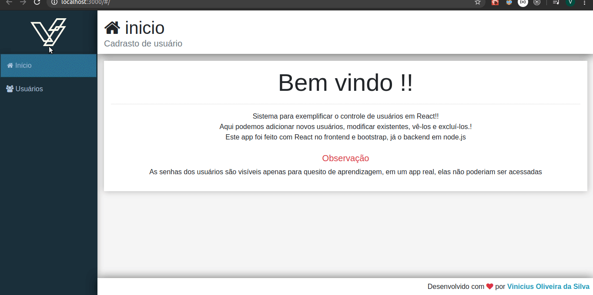
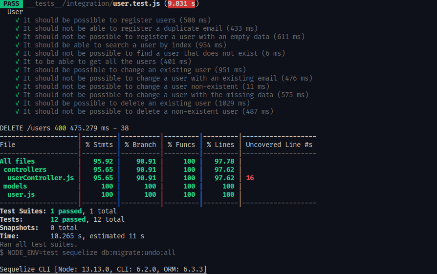

## Bem vindo ao meu gerenciador de usuários.

#### Este é um app para vocẽ fazer o gerenciamente de seus usuários.

#### Tecnologias usadas :

##### FrontEnd :

> - JavaScript,
> - React,
> - Bootstrap (somente css),
> - React-Toastify para notificações ao usuário,
> - Axios para requisições no backend,
> - Eslint e Prettier para a padronização do codigo,
> - React-router-dom para rotas e SPA,
> - Font-awesome para algumas icones.

##### Backend :

> - JavaScript,
> - Nodejs,
> - Jest para testes de integração,
> - Eslint e Prettier para a padronização do codigo,
> - Sequelize para o banco de dados,
> - PostgreSql,
> - SuperTest para requisição dos testes.

###### Como instalar :

- Primeiro faça um clone desse repositório com _https://github.com/viniciu21/usersManeger.git_ ou baixe o arquivo zipado.

- Depois vá para a pasta backend e execute o comando _npm i_ ou _yarn_, em seguida, execute o mesmo comando agora na pasta frontend.

- Após isso, veja no seu banco de dados o nome de usuário, senha e o seu host (geralmente é localhost, se for no precisa mudar), e vá para o arquivo backend/.env e modifique as variáveis ambiente DB_HOST, DB_USERNAME, DB_PASSWORD para as do seu banco de dados.

> Caso o seu banco não seja PostgreSql, vocẽ precisará baixar outra dependencia que o sequelize necessita. Pode se encontrar isso na documentação oficial do sequelize _https://sequelize.org/master/manual/getting-started.html#installing_.

- Em seguida, vocẽ pode executar os testes integrados do backend do projeto, executando na pasta backend o comando _yarn test_ ou _npm run test_ e você verá os testes e quanto eles cobrem o projeto em seu terminal, podendo ver o código fonte dos testes no diretório tests.

- Ou, se quiser apenas executar o app, execute na pasta backend o comendo _yarn sequelize db:migrate_ ou _npx sequelize db:migrate_ e após isso, _npm run dev_ ou _yarn dev_ e na pasta frontend _npm start_ ou _yarn start_.

- Se tudo estiver correto, seu navegador abrirá na porta local 3000 e você poderá desfrutar do app.

###### Porêm, se quiser apenas ver o app, vou por alguns Gifs dele em uso por mim.

> Como o projeto é pequeno, colocar todas as funcionalidades dele em um unico gif

- Podemos criar, atualizar, deletar e ler usuários e para melhor compreensão dos usuário do projeto, para cada interação com os usuários, temos uma notificação de toast.

> Desculpem pela velocidade do gif, eu ainda não aprendi a usar o Peek direito.

- Agora, caso você não queira ver os testes, vou mostrar alguns prints sobre eles:

> Você também pode acessar o arquivo index.html da pasta _backend/tests/coverage/lcov-report/index.html_

Caso tenha gostado, deixe uma estrelinha (≧▽≦) (ㆁωㆁ\*)

Email para contato: viniciusoliveiras12@hotmail.com.br
